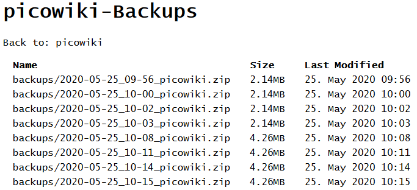

# Zip-the-Space
PHP Script to zip all files and folders (exept the backup folder) and show a list of all backups.

## Just a copy&forget backup script.   
With default settings all files and folder arround this script will be instandly archived in a easy recognizable .zip file and saved in the folder "backups", which is not archived with. The backup folder will be created in the first run. After every run, a list with all archives will be shown to download the backups.

### Feel free to change or extend the script and make it public!
